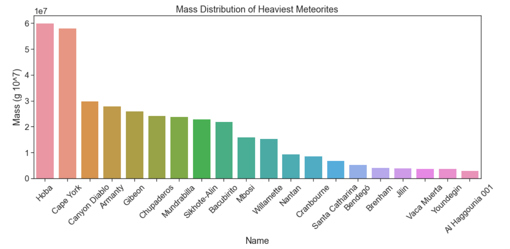
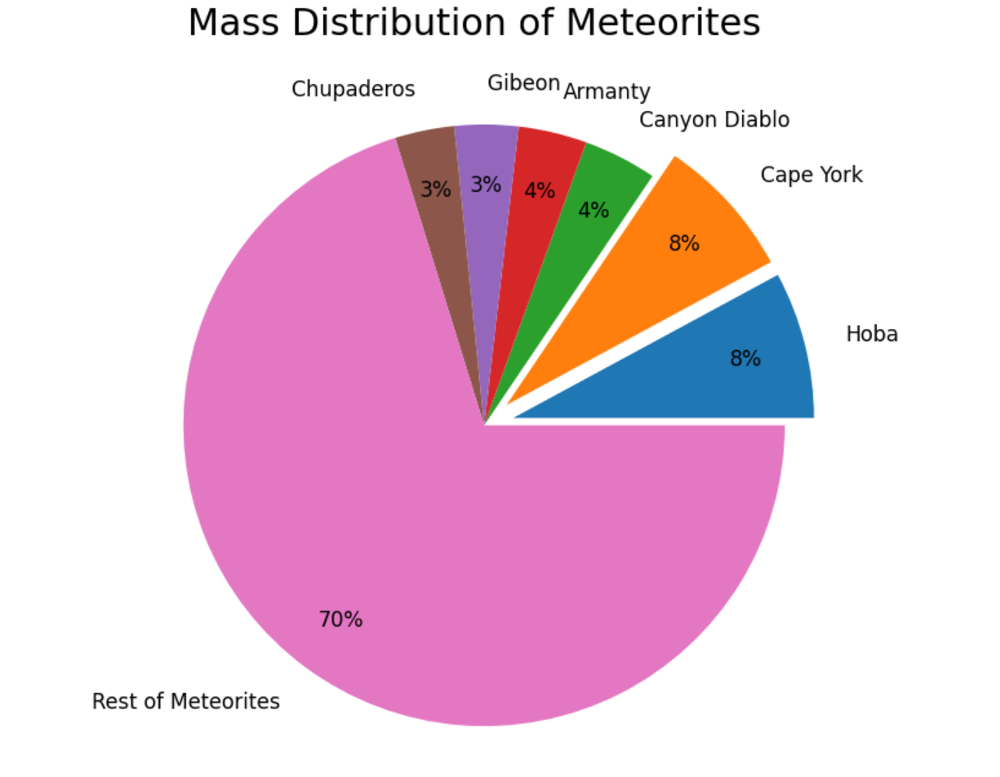

## Analysis

Add a section called analysis, and explain why exactly you chose that specific method of analysis to answer your questions. Why do you think that method of visualization would help you to answer the questions.

### 2nd Research Question: What is the mass distribution of these meteorites?

The first thing I wanted to explore is the number of light meteorites versus the number of heavy meteorites.
To do this, I split the the meteorites into three arbitrary categories, <10g, 10-100g, and >100g.

#### Number distribution of meteorites by mass category
I chose a bar plot to display this data since it made it easier to compare the number of meteorites by mass category.

Even though the numbers of meteorites in each category is about equal, I decided to explore if there was a mass distribution inequality with favour towards the >100g category.

#### Mass distribution by mass category
I chose a bar plot to display this since it shows an obvious inequality towards the heaviest meteorites.

Next, I wanted to explore the mass distribution of the top 10 heaviest meteorites to see how if there exists a strong inequality even in the top 0.001% by number.

#### Mass distribution of the heaviest meteorites
I chose a bar plot since it is easiest to compare the masses of these meteorites.

Finally, I wanted to compare the heaviest meteorites to the combined masses of the rest of the meteorites.

#### Mass distribution of heaviest meteorites compared to the rest.
I chose to use a pie plot since it was a good visual representation to compare the mass contributions of the individual heaviest meteorites compared to the rest of the meteorites.